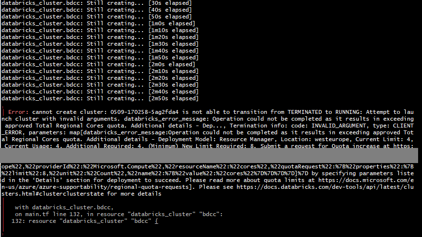
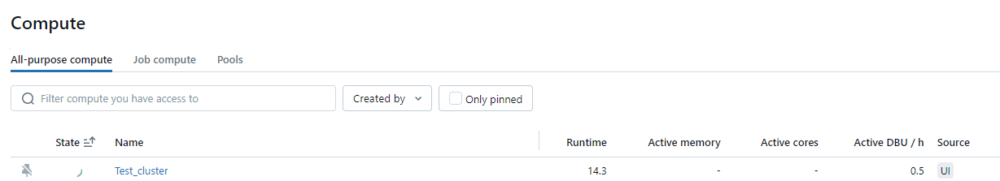
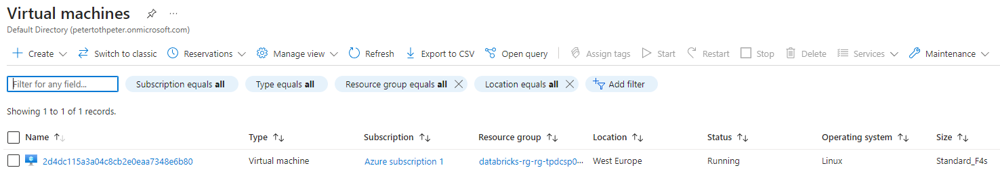
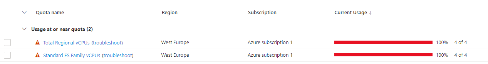

### Create a Databricks cluster with Terraform

As it was written in the [main Readme](../../README.md) file, the Azure free tier's limitations did not make it possibe for me to set up the cluster with Terraform.

Parameters were properly set, but cluster creation failed with the following error:

It can be seen on this screenshot, that the system is trying to create the cluster

The free tier's quota is 4 cores accross all applications. The Databricks' smallest possible single-node cluster requires 4 cores. This is enough to manually create the cluster, however creating the cluster through terraform failed.

Before running the terraform script, the number of virtual machines in the subscription was 0, and well as the usage for CPU cores. 

However, while creating the cluster with terraform, it seems like that automatically a virtual machine is assigned to Databrics with 4 cores, and then terraform wants to create the cluster in addition to that machine, meaning at a certain point it requires 8 cores.

With a normal Azure subscription, where core limitations can be set higher than 4, it should be no problem to set up the Cluster with Terraform